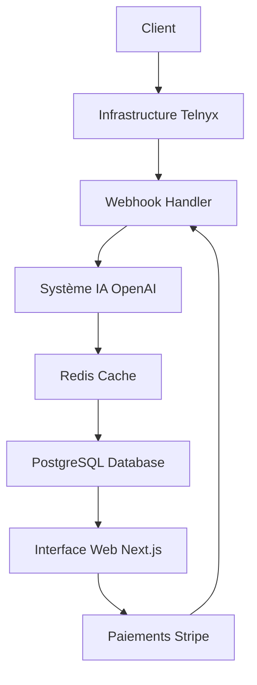
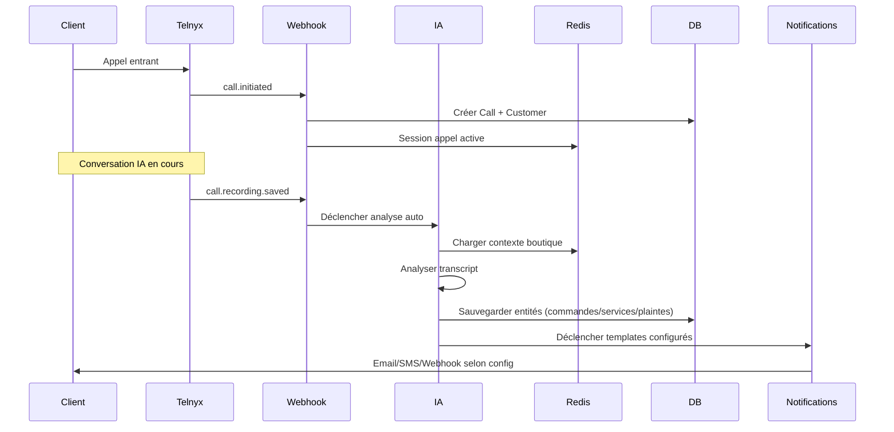

# Architecture Complète du Système Kalliky

## Table des Matières

1. [Vue d'Ensemble Générale](#vue-densemble-générale)
2. [Stack Technique](#stack-technique)
3. [Architecture Base de Données](#architecture-base-de-données)
4. [Flow Utilisateur Complet](#flow-utilisateur-complet)
5. [APIs et Services](#apis-et-services)
6. [Système d'Intelligence Artificielle](#système-dintelligence-artificielle)
7. [Infrastructure Téléphonique (Telnyx)](#infrastructure-téléphonique-telnyx)
8. [Gestion des Paiements (Stripe)](#gestion-des-paiements-stripe)
9. [Cache et Performance (Redis)](#cache-et-performance-redis)
10. [Interface Utilisateur](#interface-utilisateur)
11. [Points d'Amélioration](#points-damélioration)
12. [Roadmap](#roadmap)

---

## Vue d'Ensemble Générale

### 🎯 Mission du Système

Kalliky est une **plateforme d'assistant téléphonique IA** permettant aux entreprises (restaurants, salons de coiffure, cabinets de consultation, etc.) de traiter automatiquement les appels entrants avec une IA conversationnelle avancée capable de :

- ✅ Prendre des commandes et réservations
- ✅ Répondre aux questions sur les produits/services
- ✅ Gérer les consultations et rendez-vous
- ✅ Traiter les plaintes et réclamations
- ✅ Transférer vers un humain si nécessaire

### 🏗️ Architecture Générale



---

## Stack Technique

### 🖥️ Frontend & Backend
- **Framework** : Next.js 14 (App Router)
- **Langage** : TypeScript
- **UI** : Tailwind CSS + shadcn/ui
- **Authentification** : Session-based avec cookies

### 🗄️ Base de Données
- **Principal** : PostgreSQL avec Prisma ORM
- **Cache** : Redis pour sessions d'appels et cache IA
- **Indexation** : Optimisée pour les requêtes fréquentes

### 🤖 Intelligence Artificielle
- **Modèle Principal** : OpenAI GPT-4o-mini
- **Analyse Audio** : OpenAI Whisper (futur)
- **Streaming** : OpenAI Realtime API (plan Pro)

### ☎️ Infrastructure Téléphonique
- **Provider** : Telnyx Voice API
- **Gestion** : Webhooks automatiques
- **Enregistrement** : Stockage automatique

### 💳 Paiements
- **Processor** : Stripe
- **Modèle** : SaaS avec commissions
- **Automatisation** : Webhooks intégrés

---

## Architecture Base de Données

### 🏢 Modèles Principaux

```typescript
// UTILISATEURS & ENTREPRISES
User (id, email, password, role, stripeCustomerId)
Business (id, name, type, ownerId) 
Store (id, name, businessId, hasProducts, hasReservations, hasConsultations)
Subscription (id, businessId, plan, status, stripeSubscriptionId)

// TÉLÉPHONIE
PhoneNumber (id, number, telnyxId, businessId, status, monthlyPrice)
Call (id, telnyxCallId, businessId, customerId, transcript, aiSummary)
AIConversationSession (id, callId, businessId, messages, totalCost)

// CLIENTS
Customer (id, phone, businessId, status, totalSpent, orderCount)
CustomerBehavior (id, customerId, favoriteCategories, loyaltyScore)
CustomerExchange (id, customerId, type, description, content)

// CATALOGUE & COMMANDES
Product (id, storeId, name, description, status, aiKeywords)
ProductVariation (id, productId, name, type, value, prices)
Order (id, customerId, storeId, items, total, status)
PreparationTicket (id, orderId, items, status, priority)

// SERVICES UNIVERSELS
UniversalService (id, storeId, name, pattern, isActive)
ServiceBooking (id, serviceId, customerId, startDateTime, status)
ServiceResource (id, storeId, type, name, isActive, specifications)

// CONSULTATIONS
Consultation (id, storeId, customerId, scheduledAt, status, price)

// RÉSERVATIONS  
Reservation (id, storeId, customerId, startDateTime, partySize, status)

// INTELLIGENCE ARTIFICIELLE
IntelligentAIConfig (id, storeId, voiceOnboarding, automationLevel)
WeatherRecommendation (id, storeId, currentWeather, activeProducts)

// NOTIFICATIONS
NotificationConfig (id, storeId, activityType, isActive)
NotificationTemplate (id, storeId, actionType, name, body, variables)
NotificationQueueItem (id, storeId, status, payload, scheduledAt)
```

### 🔑 Relations Clés

1. **Hiérarchie Business** : `User → Business → Store → Subscription`
2. **Téléphonie** : `Business → PhoneNumber → Call → AISession`
3. **Clients** : `Business → Customer → Order/Reservation/Consultation`
4. **Services** : `Store → UniversalService → ServiceBooking`
5. **IA** : `Store → IntelligentAIConfig → AISession`

---

## Flow Utilisateur Complet

### 📝 1. SIGNUP & ONBOARDING

#### ✅ **Ce qui fonctionne parfaitement**

**Étape 1 : Choix du Plan**
```typescript
// Plans disponibles avec fonctionnalités claires
const plans = [
  {
    id: 'STARTER', price: '129€', 
    features: ['IA basique', '1 appel simultané', 'Prise commande simple']
  },
  {
    id: 'PRO', price: '329€',
    features: ['IA Premium', '6 appels simultanés', 'Vente additionnelle']
  }
]
```

**Étape 2 : Création Compte & Business**
```typescript
// Process complet via /api/stripe/checkout-signup
{
  userData: { firstName, lastName, email, password, phone },
  businessData: { name, type },
  storeData: { name, address, hasProducts, hasReservations, hasConsultations }
}
```

**Étape 3 : Paiement Stripe → Webhook Automatique**
```typescript
// Webhook Stripe crée automatiquement :
- User + Business + Store
- Subscription active
- PhoneNumber via Telnyx Auto-Purchase
- Cache Redis pré-chargé
```

#### ⚠️ **Points d'amélioration**

1. **Email de Bienvenue** - Pas encore implémenté
2. **Onboarding Guidé** - Manque un wizard de configuration
3. **Validation Telnyx** - Pas de vérification si achat numéro réussit

---

### 🏪 2. CONFIGURATION BOUTIQUE

#### ✅ **Fonctionnalités Opérationnelles**

**Configuration Multi-Services** 
```typescript
// Tous les types d'activité supportés
store: {
  hasProducts: true,    // Restaurant, boulangerie, fast-food
  hasReservations: true, // Tables, chambres, créneaux
  hasConsultations: true // Médecin, avocat, coach
}
```

**Upload Menu/Catalogue IA**
```typescript
// Endpoint : /api/ai/menu-upload
- Upload PDF/Excel/Image
- Extraction OCR/IA
- Génération automatique produits
- Mapping intelligents composants
```

**Services Universels** 
```typescript
// Pattern flexible pour tout type service
{
  pattern: 'FLEXIBLE_BOOKING' | 'FIXED_SLOTS' | 'AVAILABILITY',
  scheduleConfig: { workingHours, slotConfig, bookingRules },
  customFields: [{ name, type, required, config }]
}
```

#### ❌ **Ce qui manque**

1. **Assistant Configuration** - Pas de guide étape par étape
2. **Templates par Secteur** - Pas de configs pré-définies
3. **Validation Données** - Vérification complétude manquante
4. **Preview IA** - Pas de test avant mise en prod

---

### ☎️ 3. GESTION TÉLÉPHONIE

#### ✅ **Système Completement Fonctionnel**

**Auto-Purchase Telnyx**
```typescript
// Classe TelnyxAutoPurchaseService
async purchaseNumberForStore(businessId, storeId, countryCode) {
  1. Crée Voice App automatiquement
  2. Recherche numéros disponibles
  3. Achète le meilleur numéro
  4. Configure webhooks
  5. Sauvegarde en DB avec config
}
```

**Gestion Webhooks Telnyx**
```typescript
// /api/telnyx/webhook traite :
'call.initiated' → Création Call + Customer si nouveau
'call.answered' → Update métadonnées appel
'call.hangup' → Calcul durée + stats
'call.recording.saved' → Déclenche analyse IA automatique
```

**Suspension/Réactivation**
```typescript
// Automatique via Stripe webhooks
- Non-paiement → Suspension numéros
- Paiement OK → Réactivation automatique  
- Annulation → Release définitif
```

#### ⚠️ **Points d'amélioration**

1. **Interface Gestion** - Pas d'UI pour gérer les numéros
2. **Call Forwarding** - Renvoi vers humain pas implémenté
3. **Multi-numéros** - Un seul numéro par business pour l'instant

---

### 🤖 4. SYSTÈME IA

#### ✅ **Architecture IA Avancée**

**Contexte Intelligent par Boutique**
```typescript
// Chargement complet données boutique
interface CompleteStoreData {
  products: Array<{ name, description, price, aiKeywords }>,
  services: Array<{ name, duration, price, available }>,
  consultations: Array<{ type, duration, price, expertiseLevel }>,
  businessHours: Object,
  aiPersonality: 'professionnel' | 'amical' | 'cool',
  voiceType: 'femme' | 'homme',
  automationLevel: number
}
```

**Cache Redis Optimisé**
```typescript
// Données pré-chargées pour performance
await redisService.cacheStoreData(storeId, {
  businessContext: "contexte personnalisé",
  productsContext: "liste produits formatée IA",
  servicesContext: "services disponibles",
  systemPrompt: "prompt personnalisé par boutique"
});
```

**Analyse Post-Appel Automatique**
```typescript
// /api/ai/process-call/[callId]
const analysis = await analyzeCallRecording(callId, recordingUrl, transcript);
// Génère automatiquement :
- Commandes détectées
- Services demandés  
- Consultations programmées
- Signalements/plaintes
- Sentiment client
- Actions à suivre
```

#### ❌ **Limitations Actuelles**

1. **Transcription Temps Réel** - Pas encore de Whisper intégré
2. **OpenAI Realtime** - Pas implémenté (prévu plan Pro)
3. **Voix Clonées** - Pas de clonage voix custom
4. **Tests A/B** - Pas de variants IA

---

### 📊 5. TRAITEMENT APPELS (Flow Complet)

#### ✅ **Process Automatisé de A à Z**



**Entités Créées Automatiquement**
```typescript
// Résultat analyse IA sauvegardé en DB
{
  orders: [{ items, total, deliveryType, urgency }],
  services: [{ name, requestedDate, price, urgency }], 
  consultations: [{ problem, urgency, recommendation }],
  signalements: [{ category, description, actions }],
  conversation: { sentiment, satisfaction, summary }
}
```

#### ⚠️ **Améliorations Nécessaires**

1. **Confirmation Client** - Pas de validation commandes
2. **Intégrations CRM** - Pas de sync externe
3. **Paiements Directs** - Pas de prise paiement par téléphone

---

### 📱 6. INTERFACE UTILISATEUR

#### ✅ **Dashboard & UX Excellents**

**Dashboard Principal**
- 📊 Métriques temps réel (revenus, commandes, satisfaction)
- 📈 Graphiques performance mensuelle  
- 📞 Appels récents avec détails clients
- 👥 Profils clients enrichis
- 🎫 Tickets de préparation

**Gestion Multi-Activités**
- 🏪 Stores multiples par utilisateur
- ⚙️ Configuration granulaire par service
- 📋 Templates de notification personnalisables
- 👨‍💼 Gestion employés/ressources/planning

**Interface Mobile-First**
- 📱 Design responsive complet
- ⚡ Performance optimisée
- 🎨 UI moderne avec shadcn/ui

#### ⚠️ **Fonctionnalités Manquantes**

1. **Analytics Avancés** - Pas de drill-down détaillé
2. **Exports** - Pas d'export données
3. **Rapports Automatiques** - Pas de reporting périodique
4. **App Mobile** - Que PWA pour l'instant

---

## APIs et Services

### 🔌 APIs Principales

#### ✅ **Authentification**
```typescript
POST /api/auth/register     // Inscription complète
POST /api/auth/login        // Connexion
POST /api/auth/logout       // Déconnexion  
POST /api/auth/auto-login-signup // Auto-login post-Stripe
```

#### ✅ **Gestion Boutiques**
```typescript
GET /api/stores             // Liste boutiques
POST /api/stores            // Créer boutique
GET /api/stores/[id]        // Détails boutique
PUT /api/stores/[id]        // Modifier boutique
GET /api/stores/cache       // Invalider cache
```

#### ✅ **Téléphonie Telnyx**
```typescript
POST /api/telnyx/webhook              // Webhooks appels
POST /api/telnyx/numbers/auto-purchase // Achat auto numéro
GET /api/telnyx/phone-numbers         // Liste numéros
```

#### ✅ **Intelligence Artificielle** 
```typescript
POST /api/ai/menu-upload           // Upload menu IA
GET /api/ai/upload-status/[id]     // Statut upload
POST /api/ai/process-menu          // Traiter menu IA
POST /api/ai/process-call/[id]     // Analyser appel
GET /api/ai/intelligent-config/[id] // Config IA boutique
POST /api/ai/voice-onboarding/[id] // Onboarding vocal
```

#### ✅ **Paiements Stripe**
```typescript
POST /api/stripe/checkout-signup     // Checkout inscription
POST /api/stripe/checkout           // Checkout standard  
POST /api/stripe/webhook            // Webhooks Stripe
GET /api/stripe/payment-methods     // Moyens paiement
```

#### ✅ **Notifications**
```typescript
GET /api/app/notifications/configs    // Config notifications
POST /api/app/notifications/trigger  // Déclencher notification
GET /api/app/notifications/templates // Templates
GET /api/app/notifications/queue     // File notifications
```

### 🔧 Services Backend

#### ✅ **Store Data Loader**
```typescript
// Service complet chargement données boutique
async loadCompleteStoreData(storeId) {
  - Charge produits, services, consultations
  - Récupère config IA et templates  
  - Construit contexte optimisé pour IA
  - Gère cache Redis automatiquement
}
```

#### ✅ **AI Call Analyzer**
```typescript  
// Analyse IA complète des appels
async analyzeCallRecording(callId, recordingUrl, transcript) {
  - Utilise contexte boutique personnalisé
  - Détecte commandes/services/signalements
  - Calcule sentiment et satisfaction  
  - Retourne entités structurées
}
```

#### ✅ **Cache Service**
```typescript
// Gestion cache Redis performance
class StoreCacheService {
  - Pre-cache données boutiques actives
  - Invalidation cache intelligente
  - Génération prompts IA optimisés
  - Metrics et monitoring cache
}
```

---

## Système d'Intelligence Artificielle

### 🧠 Architecture IA

#### ✅ **Modèles & Capabilities**

**Modèle Principal : GPT-4o-mini**
- ⚡ Latence ~1-2 secondes  
- 💰 Coût optimisé pour volume
- 🎯 Fine-tuné pour commerce/service
- 🌍 Support multilingue (FR/EN/AR prévu)

**Contexte Intelligent**
```typescript
// Prompt personnalisé par boutique
const analysisPrompt = `
Tu es l'expert IA de ${businessName} - ${storeName}
Personnalité: ${aiPersonality}
Type voix: ${voiceType} 
Style: ${voiceStyle}

CATALOGUE PRODUITS:
${productsContext}

SERVICES DISPONIBLES: 
${servicesContext}

INSTRUCTIONS: Détecte et structure commandes, services, 
consultations et signalements selon contexte boutique.
`;
```

#### ✅ **Analyse Post-Appel Automatique**

**Détection Multi-Entités**
```typescript
interface CallAnalysisResult {
  orders: Array<{
    items: Array<{ name, quantity, customizations, finalPrice }>,
    total: number,
    deliveryType: 'dine-in' | 'takeaway' | 'delivery',
    urgency: 'normal' | 'high' | 'emergency'
  }>,
  services: Array<{
    name: string,
    requestedDate?: string,
    duration?: number,
    price: number
  }>,
  consultations: Array<{
    problem: string,
    urgency: string,
    recommendation: string,
    expertiseRequired?: string
  }>,
  signalements: Array<{
    category: string,
    description: string, 
    urgency: string,
    requestedActions: string[]
  }>,
  conversation: {
    sentiment: 'positive' | 'neutral' | 'negative',
    satisfaction: number, // 1-10
    summary: string,
    followUpRequired: boolean
  }
}
```

#### ⚠️ **Limitations Actuelles**

1. **Temps Réel** - Pas encore OpenAI Realtime API  
2. **Voix Custom** - Pas de clonage voix
3. **Learning** - Pas d'apprentissage continu
4. **Interruptions** - Pas de gestion coupures de parole

---

### 🚀 Optimisations Performance

#### ✅ **Cache Multi-Niveau**

**Redis Cache**
```typescript
// Cache données boutique optimisé IA
await redisService.cacheStoreData(storeId, {
  businessContext: "contexte formaté",
  productsContext: "produits optimisés prompt", 
  systemPrompt: "prompt personnalisé généré",
  lastUpdated: timestamp
});
```

**Cache Prompts IA** 
```typescript
// Prompts pré-générés et mis en cache
await redisService.cacheStoreAIPrompt(storeId, {
  systemPrompt: "prompt système",
  businessContext: "contexte entreprise", 
  productsContext: "catalogue formaté",
  servicesContext: "services formatés"
});
```

#### ✅ **Optimisation Contexte**
- 📊 Données pré-structurées pour prompts
- ⚡ Chargement asynchrone contexte
- 🎯 Contexte adaptatif selon type appel
- 📈 Monitoring performance requêtes IA

---

## Infrastructure Téléphonique (Telnyx)

### ☎️ Architecture Telnyx

#### ✅ **Auto-Purchase System**

**Achat Automatique Numéros**
```typescript
class TelnyxAutoPurchaseService {
  async purchaseNumberForStore(businessId, storeId, countryCode) {
    // 1. Créer Voice App automatiquement  
    const voiceApp = await telnyx.createVoiceApp(
      `Kalliky-${storeName}-${countryCode}`,
      webhookUrl
    );
    
    // 2. Rechercher numéros disponibles
    const numbers = await telnyx.searchAvailableNumbers(countryCode);
    
    // 3. Acheter le meilleur numéro
    const purchase = await telnyx.purchaseNumber(numbers[0].id, voiceApp.id);
    
    // 4. Sauvegarder configuration
    await prisma.phoneNumber.create({
      number: purchase.phone_number,
      telnyxId: purchase.id,  
      telnyxConfig: { voiceAppId: voiceApp.id }
    });
  }
}
```

**Gestion États Numéros**
```typescript
enum PhoneNumberStatus {
  PENDING,   // En cours d'achat
  ACTIVE,    // Opérationnel  
  SUSPENDED, // Suspendu (non-paiement)
  CANCELLED, // Annulé définitivement
  ERROR      // Erreur achat
}
```

#### ✅ **Webhooks Handler Complet**

**Types Événements Gérés**
```typescript
// /api/telnyx/webhook
switch (event_type) {
  case 'call.initiated':
    // Créer Call + Customer si nouveau
    // Démarrer session Redis
    
  case 'call.answered': 
    // Update métadonnées appel
    // Potentiel: déclencher IA temps réel
    
  case 'call.hangup':
    // Calculer durée, coût
    // Finaliser session
    
  case 'call.recording.saved':
    // DÉCLENCHER ANALYSE IA AUTOMATIQUE
    fetch(`/api/ai/process-call/${callId}`, { method: 'POST' });
}
```

#### ✅ **Gestion Multi-Pays**

**Prix par Pays**
```typescript
const prices = {
  'FR': 1.00, // France
  'US': 1.00, // USA
  'GB': 1.20, // UK
  'DE': 1.50, // Allemagne
  'ES': 1.50, // Espagne
  // ... Extensible
};
```

### ⚠️ **Améliorations Prévues**

1. **Call Forwarding** - Transfert vers humain
2. **Multi-numéros** - Plusieurs numéros par business  
3. **Routage Intelligent** - Selon horaires/disponibilités
4. **SIP Integration** - Pour PBX existants

---

## Gestion des Paiements (Stripe)

### 💳 Architecture Stripe

#### ✅ **Modèle SaaS Complet**

**Plans Tarifaires**
```typescript
const plans = {
  STARTER: {
    price: 129, // €/mois  
    commission: 0.10, // 10% par commande
    features: ['IA basique', '1 appel simultané']
  },
  PRO: {
    price: 329, // €/mois
    commission: 1.00, // 1€ fixe par commande  
    features: ['IA Premium', '6 appels simultanés', 'Vente additionnelle']
  },
  BUSINESS: {
    price: 'custom',
    commission: 0.90, // 90c par commande
    features: ['Tout Pro +', 'Voix clonée', 'White-label']
  }
}
```

#### ✅ **Automation Complète Signup**

**Flow Inscription Stripe**
```typescript
// /api/stripe/checkout-signup
POST {
  userData: { firstName, lastName, email, password },
  businessData: { name, type },  
  storeData: { name, address, services },
  plan: 'PRO'
}

// Webhook automatique post-paiement
'checkout.session.completed' → {
  1. Créer User + Business + Store
  2. Créer Subscription active  
  3. Déclencher achat numéro Telnyx
  4. Pré-charger cache Redis
  5. Email bienvenue (à implémenter)
}
```

#### ✅ **Gestion Abonnements Avancée**

**Webhooks Stripe Gérés**
```typescript
// /api/stripe/webhook
'checkout.session.completed' → Création compte complet
'customer.subscription.updated' → Update statut abonnement
'customer.subscription.deleted' → Suspension services  
'invoice.payment_succeeded' → Réactivation auto
'invoice.payment_failed' → Suspension numéros Telnyx
```

**Automatisation Telnyx-Stripe**
```typescript
// Suspension automatique non-paiement
async suspendNumberForBusiness(businessId) {
  const phoneNumbers = await prisma.phoneNumber.findMany({ businessId });
  for (const phone of phoneNumbers) {
    await telnyx.suspendNumber(phone.number);
    await prisma.phoneNumber.update({ 
      data: { status: 'SUSPENDED', suspendedAt: new Date() }
    });
  }
}
```

#### ✅ **Multi-Activités**

**Gestion Activités Multiples**
```typescript
// Un user peut avoir plusieurs business/stores
// Chaque store a son abonnement Stripe séparé
// Facturation indépendante par activité
```

### ⚠️ **Améliorations Futures**

1. **Usage-Based Billing** - Facturation selon volume appels
2. **Credits System** - Crédits pré-payés  
3. **Trials Extended** - Essais plus longs selon volume
4. **Enterprise Billing** - Facturation annuelle avec remises

---

## Cache et Performance (Redis)

### ⚡ Architecture Redis

#### ✅ **Système Cache Multi-Niveau**

**Call Sessions Management**
```typescript
interface CallSession {
  callId: string,
  businessId: string,
  storeId: string, 
  aiContext: {
    businessName: string,
    services: any[],
    conversation: Array<{ role, content, timestamp }>
  },
  audioChunks: string[],
  metadata: Record<string, any>
}

// TTL: 2h pendant appel, 1h après fin
```

**Store Data Optimization**
```typescript
// Cache optimisé pour IA - données structurées
await redisService.cacheStoreData(storeId, {
  // Métadonnées boutique
  businessName, storeName, businessCategory,
  
  // Configuration IA
  aiPersonality, aiInstructions, aiLanguage,
  
  // Catalogue optimisé pour prompts
  products: [{ name, description, price, available }],
  services: [{ name, duration, price, bookingRequired }],
  
  // Paramètres opérationnels
  businessHours, timezone, currency, taxRate,
  
  // Performance
  lastUpdated, version
});
```

**AI Prompts Caching**
```typescript
// Prompts pré-générés et mis en cache 3h
await redisService.cacheStoreAIPrompt(storeId, {
  systemPrompt: "prompt personnalisé complet",
  businessContext: "contexte formaté", 
  productsContext: "catalogue optimisé IA",
  servicesContext: "services formatés"
});
```

#### ✅ **Performance Optimizations**

**Pre-loading Strategy**
```typescript
// Pré-chargement boutiques actives au démarrage
class StoreCacheService {
  static async preloadAllActiveStores() {
    const activeStores = await prisma.store.findMany({ isActive: true });
    
    // Traitement par batch de 5 pour éviter surcharge
    for (let i = 0; i < activeStores.length; i += 5) {
      const batch = activeStores.slice(i, i + 5);
      await Promise.all(
        batch.map(store => this.cacheStoreData(store.id))
      );
      // Pause entre batches
      await sleep(1000);
    }
  }
}
```

**Cache Invalidation**
```typescript
// Invalidation intelligente lors de modifications
static async onStoreUpdated(storeId, updateType) {
  await redisService.invalidateStoreCache(storeId);
  await this.cacheStoreData(storeId); // Rechargement immédiat
}
```

#### ✅ **Analytics & Monitoring**

**Active Calls Tracking**  
```typescript
// Suivi appels actifs par business
await redisService.addActiveCall(businessId, callId);
await redisService.getActiveCallsCount(businessId); // Pour queuing
```

**Rate Limiting**
```typescript  
// Protection API et IA
await redisService.checkRateLimit(
  `ai_requests:${businessId}`, 
  100, // limite
  3600000 // fenêtre 1h
);
```

**Call Statistics**
```typescript
// Stats appels en temps réel
await redisService.incrementCallStats(businessId, dateKey);
const stats = await redisService.getCallStats(businessId, dateRange);
```

### ⚠️ **Optimisations Futures**

1. **Clustering Redis** - Pour haute disponibilité
2. **Cache Hierachique** - Redis + CDN pour assets
3. **Predictive Caching** - Pré-charger selon patterns usage
4. **Cache Analytics** - Monitoring hit/miss rates

---

## Interface Utilisateur

### 🎨 Architecture Frontend

#### ✅ **Design System Complet**

**Stack UI Moderne**
- ⚡ **Next.js 14** App Router pour performance
- 🎨 **Tailwind CSS** + **shadcn/ui** pour consistance
- 📱 **Mobile-First** responsive design  
- 🌙 **Dark/Light Mode** avec persistance
- 🌍 **Multilingue** FR/EN avec contexte

**Composants Réutilisables**
```typescript
// Système composants cohérent
- Cards avec glass-effect et hover animations
- Tables avec pagination et tri
- Forms avec validation temps réel
- Dialogs modaux optimisés mobile
- Charts avec Recharts intégrés
```

#### ✅ **Pages & Fonctionnalités**

**Dashboard Principal** (`/app/dashboard`)
```typescript
// Metrics temps réel
- Revenus total avec évolution %
- Commandes avec comparaison période  
- Panier moyen avec tendance
- Clients uniques avec croissance

// Visualisations
- Graphique performance mensuelle
- Commandes récentes avec drill-down
- Profils clients enrichis
```

**Gestion Multi-Stores** (`/app/stores`)
```typescript
// Boutiques multiples
- Liste stores avec statuts
- Configuration granulaire par store
- Activation/désactivation services
- Templates par type activité
```

**Configuration IA** (`/app/ai-config`)  
```typescript
// Personnalisation IA par boutique
- Choix personnalité (professionnel, amical, cool)
- Type voix (homme/femme) 
- Style conversation
- Instructions personnalisées
- Upload menu avec IA
```

**Analytics & Reporting** 
```typescript
// Tableaux de bord avancés
- Performance par période
- Satisfaction client
- Conversion appels → commandes
- ROI par canal
```

#### ✅ **UX & Interactions**

**Flow Utilisateur Optimisé**
- 🚀 **Onboarding** : 3 étapes max vers premier appel
- ⚡ **Performance** : Loading states et skeleton UI
- 🎯 **Actions** : CTAs clairs et contextuels  
- 📊 **Feedback** : Toast notifications et confirmations

**Responsive Design**
- 📱 Mobile-first avec adaptation tablette/desktop
- 👆 Touch-friendly avec zones tactiles optimisées
- ⌨️ Keyboard navigation complète
- ♿ Accessibilité WCAG 2.1 niveau AA

### ❌ **Fonctionnalités Manquantes**

#### **Analytics Avancés**
1. **Drill-down Reports** - Pas de détail par segment
2. **Custom Dashboards** - Pas de personnalisation widgets
3. **Export Data** - Pas d'export CSV/PDF/Excel
4. **Scheduled Reports** - Pas de rapports automatiques

#### **UX Improvements Needed**  
1. **Guided Tour** - Pas de tour interactif première visite
2. **Help System** - Pas d'aide contextuelle
3. **Keyboard Shortcuts** - Pas de raccourcis power users
4. **Bulk Actions** - Pas d'actions en masse

#### **Mobile App Native**
1. **iOS/Android App** - Seulement PWA pour l'instant
2. **Push Notifications** - Pas de notifs mobile natives
3. **Offline Mode** - Pas de fonctionnement offline

---

## Points d'Amélioration

### 🔧 Corrections Nécessaires

#### **❌ Bugs Critiques**

1. **Duplicate getActiveCallsCount Method** 
```typescript
// ❌ Méthode dupliquée dans RedisService
async getActiveCallsCount(businessId: string): Promise<number> // Ligne 379
async getActiveCallsCount(businessId: string): Promise<number> // Ligne 391
```

2. **Error Handling Webhook Telnyx**
```typescript  
// ❌ Pas de retry mechanism si webhook fail
// ❌ Pas de dead letter queue pour événements perdus
// ❌ Pas de monitoring alertes webhook down
```

3. **Database Indexes Missing**
```typescript
// ❌ Indexes manquants pour performance :
// - Call.telnyxCallId (queries fréquentes)
// - Customer.phone+businessId (lookups)  
// - AIConversationSession.isActive (active sessions)
```

#### **⚠️ Vulnérabilités Sécurité**

1. **API Endpoints Protection**
```typescript
// ⚠️ Pas de rate limiting sur endpoints critiques
// ⚠️ Pas de validation stricte JWT/session
// ⚠️ Pas de protection CSRF sur mutations
```

2. **Data Validation**
```typescript
// ⚠️ Input validation côté serveur insuffisante
// ⚠️ Pas de sanitization données utilisateur
// ⚠️ Pas de validation schéma JSON strict
```

3. **Secrets Management**  
```typescript
// ⚠️ Clés API en variables environnement plain text
// ⚠️ Pas de rotation automatique secrets
// ⚠️ Pas de vault pour secrets sensibles
```

### 🚀 Améliorations Performance

#### **Cache & Optimization**

1. **Database Query Optimization**
```typescript
// 🎯 Implémenter query batching
// 🎯 Ajouter connection pooling
// 🎯 Optimiser N+1 queries avec includes
// 🎯 Pagination intelligente grandes listes
```

2. **Redis Advanced Features**
```typescript  
// 🎯 Redis Clustering pour HA
// 🎯 Cache warming automatique
// 🎯 TTL dynamique selon usage patterns
// 🎯 Monitoring cache hit rates
```

3. **API Response Optimization**
```typescript
// 🎯 Response compression (gzip)
// 🎯 Field selection (GraphQL-like)  
// 🎯 Pagination avec cursors
// 🎯 ETag caching headers
```

### 🧠 IA Enhancements

#### **Advanced AI Features**

1. **Real-time AI (OpenAI Realtime API)**
```typescript
// 🎯 Latence <200ms pour plan Pro
// 🎯 Interruption handling
// 🎯 Emotion detection temps réel
// 🎯 Voice cloning custom (Business plan)
```

2. **Machine Learning Pipeline**
```typescript
// 🎯 Apprentissage continu sur conversations
// 🎯 A/B testing prompts automatique  
// 🎯 Recommandations personnalisées
// 🎯 Détection fraude/spam avancée
```

3. **Multi-modal AI**
```typescript
// 🎯 Vision AI pour menus photo
// 🎯 Sentiment analysis audio
// 🎯 OCR intelligent documents  
// 🎯 Generation images produits
```

### 📞 Telephony Advanced

#### **Call Management Pro**

1. **Advanced Call Routing**
```typescript  
// 🎯 Queue management intelligent
// 🎯 Call forwarding conditionnel
// 🎯 Overflow vers humains
// 🎯 Callback scheduling automatique
```

2. **Multi-channel Support**
```typescript
// 🎯 WhatsApp Business API
// 🎯 SMS conversationnel  
// 🎯 Chat widget website
// 🎯 Unified inbox multicanal
```

3. **Analytics Call Center**
```typescript
// 🎯 Call recording analysis batch
// 🎯 Agent performance metrics
// 🎯 Customer satisfaction scoring
// 🎯 Conversion funnel optimization
```

---

## Roadmap

### 🗓️ Q1 2024 - Foundation Complete

#### **✅ Déjà Implémenté**
- [x] **Architecture Base** - Next.js + Prisma + PostgreSQL
- [x] **Authentication System** - Session-based complet
- [x] **Stripe Integration** - Paiements + webhooks  
- [x] **Telnyx Integration** - Auto-purchase + webhooks
- [x] **Basic AI System** - GPT-4o-mini + analyse appels
- [x] **Redis Caching** - Sessions + performance
- [x] **Dashboard UI** - Interface moderne responsive
- [x] **Multi-services** - Produits + Réservations + Consultations

### 📅 Q2 2024 - AI Enhancement (EN COURS)

#### **🔄 Priorités Immédiates**

1. **🤖 AI Realtime Integration** 
   - [ ] OpenAI Realtime API (plan Pro)
   - [ ] Latence <200ms  
   - [ ] Interruption handling
   - [ ] Voice activity detection

2. **📞 Advanced Telephony**
   - [ ] Call forwarding vers humains
   - [ ] Queue management avec callbacks
   - [ ] Multi-numéros par business
   - [ ] SIP integration entreprises

3. **🔧 Bug Fixes Critiques**
   - [ ] Corriger méthode dupliquée Redis
   - [ ] Ajouter retry mechanism webhooks  
   - [ ] Optimiser database indexes
   - [ ] Sécuriser endpoints critiques

4. **🎨 UX Improvements**
   - [ ] Onboarding guidé interactif
   - [ ] Help system contextuel
   - [ ] Export données (CSV/PDF)
   - [ ] Templates secteur d'activité

### 📅 Q3 2024 - Scale & Performance

#### **🚀 Performance & Reliability**

1. **⚡ Infrastructure Scaling**
   - [ ] Redis Cluster setup
   - [ ] Database read replicas
   - [ ] CDN pour assets statiques
   - [ ] Load balancing horizontal

2. **📊 Analytics Advanced**
   - [ ] Custom dashboards
   - [ ] Predictive analytics
   - [ ] A/B testing framework
   - [ ] ROI tracking granulaire

3. **🔐 Security Enhancement**
   - [ ] HashiCorp Vault secrets
   - [ ] Rate limiting avancé
   - [ ] CSRF protection complète
   - [ ] Audit logs sécurité

4. **🌍 Internationalization**
   - [ ] Multi-langue complet (FR/EN/ES/DE)
   - [ ] Localisation interface
   - [ ] Support devises multiples
   - [ ] Numéros internationaux

### 📅 Q4 2024 - Enterprise Features

#### **👔 Business & Enterprise**

1. **🏢 Enterprise Edition**
   - [ ] White-label complet
   - [ ] Multi-tenant architecture  
   - [ ] SSO integration (SAML/OIDC)
   - [ ] Advanced permissions

2. **📱 Mobile Applications**
   - [ ] iOS App native
   - [ ] Android App native  
   - [ ] Push notifications
   - [ ] Offline mode sync

3. **🔌 Integrations Ecosystem**
   - [ ] CRM integrations (Salesforce, HubSpot)
   - [ ] POS systems (Square, Toast)
   - [ ] Accounting (QuickBooks, Xero)  
   - [ ] Marketing (Mailchimp, SendGrid)

4. **🤖 AI Advanced Features**
   - [ ] Voice cloning custom
   - [ ] Emotional intelligence
   - [ ] Predictive recommendations
   - [ ] Auto-optimization learning

### 📅 2025 - Innovation & Growth

#### **🎯 Vision Long-terme**

1. **🧠 AI Platform Evolution**
   - [ ] Multi-modal AI (text + voice + vision)
   - [ ] Conversational commerce
   - [ ] AI-powered insights business
   - [ ] Auto-pilot business mode

2. **🌐 Global Expansion**  
   - [ ] Marketplace partners
   - [ ] Regional compliance (GDPR, CCPA)
   - [ ] Local payment methods
   - [ ] Cultural adaptation AI

3. **🔮 Emerging Technologies**
   - [ ] AR/VR for training
   - [ ] Blockchain for transactions
   - [ ] IoT integration
   - [ ] Edge AI deployment

---

## Conclusion

### 🎯 État Actuel du Système

**Kalliky** est actuellement une **plateforme fonctionnelle et robuste** avec :

#### ✅ **Forces Majeures**
- **Architecture Complète** : Système end-to-end opérationnel
- **Automation Poussée** : Signup → Configuration → Appels IA → Analyse automatique
- **Multi-Services** : Support Produits + Réservations + Consultations  
- **IA Intelligente** : Contexte personnalisé par boutique + analyse automatique
- **Performance** : Cache Redis + optimisations base de données
- **UX Moderne** : Interface responsive avec design system cohérent

#### ⚠️ **Limitations Connues**  
- **IA Temps Réel** : Pas encore OpenAI Realtime (prévu Q2)
- **Call Forwarding** : Pas de transfert vers humains
- **Analytics Avancés** : Manque drill-down et exports
- **Mobile Native** : Seulement PWA pour l'instant

### 🚀 Potentiel de Croissance

Le système est **prêt pour le scale** avec :
- Architecture modulaire extensible
- Infrastructure cloud-native  
- API-first design pour intégrations
- Multi-tenant capabilities base

### 🎪 Recommandations Prioritaires

1. **🔧 Stabilité** : Corriger bugs critiques identifiés
2. **⚡ Performance** : Implémenter OpenAI Realtime API  
3. **📞 Téléphonie** : Call forwarding vers humains
4. **📊 Analytics** : Exports et dashboards personnalisables
5. **🔐 Sécurité** : Audit complet et corrections vulnérabilités

---

**Le système Kalliky représente une base solide pour révolutionner la gestion des appels téléphoniques d'entreprise avec l'IA. L'architecture est scalable, la technologie moderne, et le potentiel d'expansion considérable.**